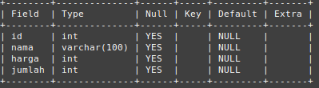
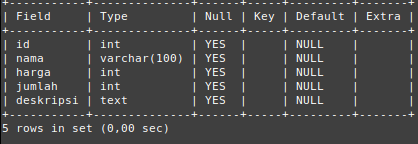

Untuk menjalankan mysql di CLI jalankan code ini:

```
sudo mysql -u root -p
```

## Data Base

`create database nama_database` untuk membuat database

`drop database nama_database` untuk menghapus database

`show databases` digunakan menampilkan semua database yang tersimpan di mysql

`use nama_database` digunakan untuk memilih database

## Tipe Data

Berikut ketentuan tipe data di mysql [[1]](https://www.youtube.com/watch?v=xYBclb-sYQ4):

- Di mysql kita bisa menentukan tipe data tiap kolom yang kita buat di sebuah tabel.
- Biasanya kita akan menggunakan tipe data sesuai dengan kebutuhan kolom yang perlu kita buat.
- Di mysql tipe data setiap kolom yang sudah ditentukan diawal tidak bisa kita ubah lagi.

Berikut contoh tipe data per kolom:

| id (number) | nama(text) | umur (number) | asal (text) |
| ----------- | ---------- | ------------- | ----------- |
| 01          | Itachi     | 25            | Konoha      |
| 02          | Kisame     | 25            | Kirigakure  |
| 03          | Hidan      | 28            | Yugakure    |

### Tipe Data Number

Secara garis besar, tipe data di mysql ada dua jenis yaitu [[1]](https://www.youtube.com/watch?v=xYBclb-sYQ4):

- integer atau tipe number bilangan bulat

![[tipe data number integer]](/img/tipe%20data%20integer.png)

- Floating point atau tipe data number pecahan


### Decimal

Pada tipe data ini kita bisa menentukan jumlah presisi (jumlah angka dibelakan koma) dan scale (jumlah digit) number [[1]](https://www.youtube.com/watch?v=xYBclb-sYQ4):

| Decimal      | Min     | Max    |
| ------------ | ------- | ------ |
| DECIMAL(5,2) | -999.99 | 999.99 |
| DECIMAL(5,0) | -99999  | 99999  |
| DECIMAL(3,1) | -99.9   | 99.9   |
| DECIMAL(3)   | -999    | 999    |

## Tipe Data String

### CHAR dan VARCHAR

Kita bisa menentukan jumlah panjang maksimal karakter yang bisa ditampung olah CHAR dan VARCHAR dengan menggunakan kurung buka lalu masukkan jumlah maksimal karakter dan akhiri kurung tutup. Misalnya CHAR(10) atau VARCHAR(10) artinya tipe data string yang jumlah karakternya dibatasi sampai 10 karakter. Maksimum ukuran CHAR dan VARCHAR adalah 65535 karakter [[1]](https://www.youtube.com/watch?v=xYBclb-sYQ4).

Berikut perbedaan antara CHAR dan VARCHAR [[1]](https://www.youtube.com/watch?v=xYBclb-sYQ4) :


### TEXT

Berbeda dengan CHAR dan VARCHAR pada TEXT ini kita tidak bisa menentukan panjang maksimumnya, TEXT sudah memiliki maksimum panjangnya sendiri. Terdapat 4 tipe data TEXT [[1]](https://www.youtube.com/watch?v=xYBclb-sYQ4):

- TINYTEXT dengan maksimum 255 karakter (~256 bytes)
- TEXT dengan maksimum 65535 karakter (~64kb)
- MEDIUMTEXT dengan maksimum 16777215 karakter (~16MB)
- LONGTEXT dengan maksimum 4294967295 karakter (~4GB)

### ENUM

Merupakan tipe data string yang bisa kita tentukan pilihan - pilihannya [[1]](https://www.youtube.com/watch?v=xYBclb-sYQ4). contohnya:

- ENUM('Pria', 'Wanita'), artinya hanya bisa menerima data Pria atau Wanita.
- ENUM('Itachi', 'Kisame', 'Pain'), artinya hanya bisa menerima data Itachi, Kisame atau Pain.

## Tipe Data Date dan Time

Berikut jenis - jenis tipe data date dan time [[1]](https://www.youtube.com/watch?v=xYBclb-sYQ4):


DATETIME dan TIMESTAMP isinya memang sama tetapi TIMESTAMP biasanya digunakan untuk informasi tambahan seperti keterangan time and date pada created at... atau last updated at... pada file

## Table

### Storage Engines

mysql memiliki berbagai cara untuk melakukan pengolahan data, ini disebut Storage Engines. secara default mysql akan menggunakan storage engine innoDB. untuk melihat storage engines yang ada di mysql dapat menggunakan perintah `show engines`.

### Melihat Table

Untuk melihat table dapat dilakukan dengan perintah `show tables`.

### Membuat Table

```
CREATE TABLE barang
(
    id     INT,
    nama   VARCHAR (100),
    harga  INT,
    jumlah INT
) ENGINE = InnoDB;
```

### Menghapus Table

`DROP TABLE nama_table` menghapus table

### Melihat Struktur Tabel

Untuk melihat struktur tabel (kolom dan tipe data kolom) dapat dilakukan dengan code `describe nama_tabel` atau bisa disingkat dengan `desc nama_tabel`

untuk melihat struktur code cara buat table dapat dilakaukan dengan code `show create table nama_table`

### Mengubah Table

Kita dapat mengubah tabel (menambah kolom, menghapus kolom, merename kolom atau memodifikasi kolom) menggunakan `ALTER TABLE nama_table` yang disertai dengan perintah untuk mengubah kolom[[1]](https://www.youtube.com/watch?v=xYBclb-sYQ4). Berikut perintah - perintah tersebut [[1]](https://www.youtube.com/watch?v=xYBclb-sYQ4):

- `ADD COLUMN nama_column TIPE_DATA,` <br> untuk menambah kolom
- `DROP COLUMN nama_column` <br> untuk menghapus kolom
- `RENAME COLUMN nama_column TO nama_baru_column` <br> digunakan untuk mengubah nama column
- `MODIFY nama_column TIPE_DATA_BARU AFTER nama_colomn_lain` <br> untuk mengubah tipe data column. `AFTER nama_column_lain` posisi column yang dimaksud juga akan diubah di posisi di bawah column_lain
- `MODIFY nama_column TIPE_DATA_BARU FIRST` <br> code `FIRST` digunakan untuk memindahkan posisi column ke posisi paling atas

Berikut contoh penggunaannya:

- Menambah column

  ```
  ALTER TABLE barang
  ADD COLUMN deskripsi TEXT;
  ```

  Code di atas artinya di table barang kita menambahkan column baru dengan nama deskripsi dan tipe data TEXT. Dibawan ini merupakan gambar table barang sebelum ditambah column deskripsi:
  

  Setelah ditambahkan column deskripsi tampilan table barang akan jadi seperti ini.
  

- Menghapus Column <br>
  Berikut merupakan tampilan table barang di dalamnya terdapat column tumbal, kita akan menghapus column tersebut.

  

  Berikut code untuk menghapus column tumbal

  ```
  ALTER TABLE barang
  DROP COLUMN tumbal;
  ```

  Setelah dihapus hasilnya akan seperti ini (column tumbal hilang)
  

- Modifikasi Column <br>
  Kita bisa mengubah tipe data dan posisi column di dalam table. Berikut tampilan table barang sebelum column dimodify
  

  Kita akan mengubah tipe data column modify dari varchar(100) jadi integer:

  ```
  ALTER TABLE barang
  MODIFY nama INT;
  ```

  Berikut hasilnya setelah table barang dimodify
  

  Selanjutnya kita akan mengubah struktur table barang yaitu memindahkan posisi column modify di posisi tepat dibawah column harga.

  ```
  ALTER TABLE barang
  MODIFY modify INT AFTER harga
  ```

  Seperti yang terlihat di code diatas walaupun kita hanya merubah posisi columnya saja, tipe data column tetap harus ditulis. Berikut hasilnya:
  

  Terlihat column modify berpindah posisi tepat di bawah column harga.

  Kita juga bisa mengubah posisi column menjadi di posisi pertama atau paling atas. Misalnya kita akan memindahkan column deskripsi ke posisi paling atas:

  ```
  ALTER TABLE barang
  MODIFY deskripsi TEXT FIRST;
  ```

  Maka hasilnya akan seperti ini:
  

### Null Value

Null adalah nilai ketika kita tidak mengisi data ke dalam kolom. Secara default, saat kita membuat kolom, kolom tersebut bisa bernilai NULL. jika kita tidak ingin menerima nilai NULL, kita bisa menambahkan NOT NULL ketika membuat kolom [[1]](https://www.youtube.com/watch?v=xYBclb-sYQ4).

Kita bisa menambahkan NOT NULL di kolom pada saat membuat tabel seperti ini:

```
CREATE TABLE barang
(
    id     INT NOT NULL,
    nama   VARCHAR (100),
    harga  INT,
    jumlah INT
) ENGINE = InnoDB;
```

Atau jika kita sudah terlanjur tabel tanpa mengatur value NOT NULL kita masih memodifikasinya menggunakan ALTER seperti ini:

```
ALTER TABLE barang
MODIFY id INT NOT NULL;
```

Sehingga hasilnya seperti ini, value Null di id menjadi NO


Ini artinya value pada id tidak boleh null, jadi jika kita memasukkan data dan id-nya tidak di-set datanya maka dia akan ditolak

### Default Value

Saat kita menyimpan data ke dalam tabel, lalu kita hanya menyimpan beberapa kolom (tidak semuanya), kolom yang tidak kita beri nilai secara default nilainya adalah NULL [[1]](https://www.youtube.com/watch?v=xYBclb-sYQ4). Tetapi kita bisa mengatur default value setiap kolom pada tabel yang kita buat menggunakan perintah `DEFAULT value` seperti ini:

```
CREATE TABLE barang
(
    id     INT NOT NULL DEFAULT 0,
    nama   VARCHAR (100),
    harga  INT NOT NULL DEFAULT 0,
    jumlah INT NOT NULL DEFAULT 0
) ENGINE = InnoDB;
```

Jika kita sudah terlanjur membuat table tanpa mengatur default value pada column kita masih bisa mengaturnya menggunakan pertintah `ALTER TABLE` , misalnya kita ingin mengubah default value pada id dan harga nantinya akan jadi seperti ini:

```
ALTER TABLE barang
MODIFY deskripsi VARCHAR(100) NOT NULL DEFAULT '',
MODIFY harga INT NOT NULL DEFAULT 0,
MODIFY jumlah INT NOT NULL DEFAULT 0;
```

Sehingga hasilnya akan seperti ini (column deskripsi memiliki default value string kosong, harga dan jumlah memiliki default value 0)


Khusus tipe data DATETIME atau TIMESTAMP, jika kita ingin menggunakan default value dengan nilai waktu saat ini, kita bisa gunakan kata kunci CURRENT_TIMESTAMP

## Referensi

- [1][programmer zaman now](https://www.youtube.com/watch?v=xYBclb-sYQ4)

[[1]](https://www.youtube.com/watch?v=xYBclb-sYQ4)
