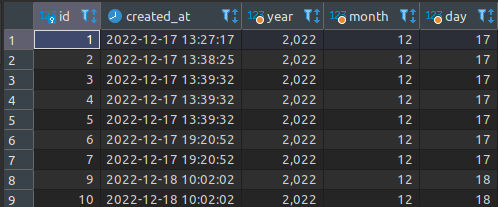
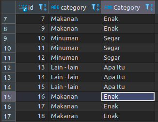
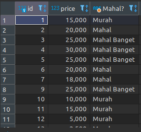
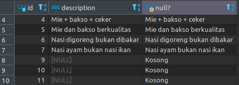
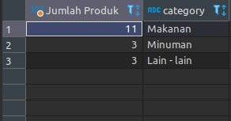
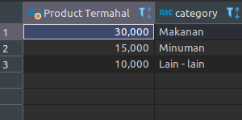
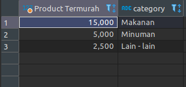
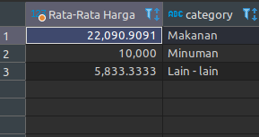
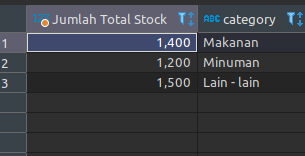

Untuk menjalankan mysql di CLI jalankan code ini:

```
sudo mysql -u root -p
```

## Data Base

`CREATE DATABASE nama_database` untuk membuat database

`DROP DATABASE nama_database` untuk menghapus database

`SHOW DATABASES` digunakan menampilkan semua database yang tersimpan di mysql

`USE nama_database` digunakan untuk memilih database yang akan di jalankan

## Tipe Data

Berikut ketentuan tipe data di mysql [[1]](https://www.youtube.com/watch?v=xYBclb-sYQ4):

- Di mysql kita bisa menentukan tipe data tiap kolom yang kita buat di sebuah tabel.
- Biasanya kita akan menggunakan tipe data sesuai dengan kebutuhan kolom yang perlu kita buat.
- Di mysql tipe data setiap kolom yang sudah ditentukan diawal tidak bisa kita ubah lagi.

Berikut contoh tipe data per kolom:

| id (number) | nama(text) | umur (number) | asal (text) |
| ----------- | ---------- | ------------- | ----------- |
| 01          | Itachi     | 25            | Konoha      |
| 02          | Kisame     | 25            | Kirigakure  |
| 03          | Hidan      | 28            | Yugakure    |

### Tipe Data Number

Secara garis besar, tipe data di mysql ada dua jenis yaitu [[1]](https://www.youtube.com/watch?v=xYBclb-sYQ4):

- integer atau tipe number bilangan bulat

![[tipe data number integer]](/img/tipe%20data%20integer.png)

- Floating point atau tipe data number pecahan


### Decimal

Pada tipe data ini kita bisa menentukan jumlah presisi (jumlah angka dibelakan koma) dan scale (jumlah digit) number [[1]](https://www.youtube.com/watch?v=xYBclb-sYQ4):

| Decimal      | Min     | Max    |
| ------------ | ------- | ------ |
| DECIMAL(5,2) | -999.99 | 999.99 |
| DECIMAL(5,0) | -99999  | 99999  |
| DECIMAL(3,1) | -99.9   | 99.9   |
| DECIMAL(3)   | -999    | 999    |

## Tipe Data String

### CHAR dan VARCHAR

Kita bisa menentukan jumlah panjang maksimal karakter yang bisa ditampung olah CHAR dan VARCHAR dengan menggunakan kurung buka lalu masukkan jumlah maksimal karakter dan akhiri kurung tutup. Misalnya CHAR(10) atau VARCHAR(10) artinya tipe data string yang jumlah karakternya dibatasi sampai 10 karakter. Maksimum ukuran CHAR dan VARCHAR adalah 65535 karakter [[1]](https://www.youtube.com/watch?v=xYBclb-sYQ4).

Berikut perbedaan antara CHAR dan VARCHAR [[1]](https://www.youtube.com/watch?v=xYBclb-sYQ4) :


### TEXT

Berbeda dengan CHAR dan VARCHAR pada TEXT ini kita tidak bisa menentukan panjang maksimumnya, TEXT sudah memiliki maksimum panjangnya sendiri. Terdapat 4 tipe data TEXT [[1]](https://www.youtube.com/watch?v=xYBclb-sYQ4):

- TINYTEXT dengan maksimum 255 karakter (~256 bytes)
- TEXT dengan maksimum 65535 karakter (~64kb)
- MEDIUMTEXT dengan maksimum 16777215 karakter (~16MB)
- LONGTEXT dengan maksimum 4294967295 karakter (~4GB)

### ENUM

Merupakan tipe data string yang bisa kita tentukan pilihan - pilihannya [[1]](https://www.youtube.com/watch?v=xYBclb-sYQ4). contohnya:

- ENUM('Pria', 'Wanita'), artinya hanya bisa menerima data Pria atau Wanita.
- ENUM('Itachi', 'Kisame', 'Pain'), artinya hanya bisa menerima data Itachi, Kisame atau Pain.

## Tipe Data Date dan Time

Berikut jenis - jenis tipe data date dan time [[1]](https://www.youtube.com/watch?v=xYBclb-sYQ4):


DATETIME dan TIMESTAMP isinya memang sama tetapi TIMESTAMP biasanya digunakan untuk informasi tambahan seperti keterangan time and date pada created at... atau last updated at... pada file

## Table

### Storage Engines

mysql memiliki berbagai cara untuk melakukan pengolahan data, ini disebut Storage Engines. secara default mysql akan menggunakan storage engine innoDB. untuk melihat storage engines yang ada di mysql dapat menggunakan perintah `show engines`.

### Melihat Table

Untuk melihat table dapat dilakukan dengan perintah `show tables`.

### Membuat Table

```
CREATE TABLE barang (
    id     int,
    nama   varcaher(100),
    harga  int,
    jumlah int
);
```

### Menghapus Table

`DROP TABLE nama_table` menghapus table

### Melihat Struktur Tabel

Untuk melihat struktur tabel (kolom dan tipe data kolom) dapat dilakukan dengan code `describe nama_tabel` atau bisa disingkat dengan `desc nama_tabel`

untuk melihat struktur code cara buat table dapat dilakaukan dengan code `show create table nama_table`

### Mengubah Table

Kita dapat mengubah tabel (menambah kolom, menghapus kolom, merename kolom atau memodifikasi kolom) menggunakan `ALTER TABLE nama_table` yang disertai dengan perintah untuk mengubah kolom[[1]](https://www.youtube.com/watch?v=xYBclb-sYQ4). Berikut perintah - perintah tersebut [[1]](https://www.youtube.com/watch?v=xYBclb-sYQ4):

- `ADD COLUMN nama_column TIPE_DATA,` <br> untuk menambah kolom
- `DROP COLUMN nama_column` <br> untuk menghapus kolom
- `RENAME COLUMN nama_column TO nama_baru_column` <br> digunakan untuk mengubah nama column
- `MODIFY nama_column TIPE_DATA_BARU AFTER nama_colomn_lain` <br> untuk mengubah tipe data column. `AFTER nama_column_lain` posisi column yang dimaksud juga akan diubah di posisi di bawah column_lain
- `MODIFY nama_column TIPE_DATA_BARU FIRST` <br> code `FIRST` digunakan untuk memindahkan posisi column ke posisi paling atas

Berikut contoh penggunaannya:

- Menambah column

  ```
  ALTER TABLE barang
  ADD COLUMN deskripsi TEXT;
  ```

  Code di atas artinya di table barang kita menambahkan column baru dengan nama deskripsi dan tipe data TEXT. Dibawan ini merupakan gambar table barang sebelum ditambah column deskripsi:
  

  Setelah ditambahkan column deskripsi tampilan table barang akan jadi seperti ini.
  

- Menghapus Column <br>
  Berikut merupakan tampilan table barang di dalamnya terdapat column tumbal, kita akan menghapus column tersebut.

  

  Berikut code untuk menghapus column tumbal

  ```
  ALTER TABLE barang
  DROP COLUMN tumbal;
  ```

  Setelah dihapus hasilnya akan seperti ini (column tumbal hilang) <br>
  

- Modifikasi Column <br>
  Kita bisa mengubah tipe data dan posisi column di dalam table. Berikut tampilan table barang sebelum column dimodify <br>
  

  Kita akan mengubah tipe data column modify dari varchar(100) jadi integer:

  ```
  ALTER TABLE barang
  MODIFY nama INT;
  ```

  Berikut hasilnya setelah table barang dimodify: <br>
  

  Selanjutnya kita akan mengubah struktur table barang yaitu memindahkan posisi column modify di posisi tepat dibawah column harga.

  ```
  ALTER TABLE barang
  MODIFY modify INT AFTER harga
  ```

  Seperti yang terlihat di code diatas walaupun kita hanya merubah posisi columnya saja, tipe data column tetap harus ditulis. Berikut hasilnya: <br>
  

  Terlihat column modify berpindah posisi tepat di bawah column harga.

  Kita juga bisa mengubah posisi column menjadi di posisi pertama atau paling atas. Misalnya kita akan memindahkan column deskripsi ke posisi paling atas:

  ```
  ALTER TABLE barang
  MODIFY deskripsi TEXT FIRST;
  ```

  Maka hasilnya akan seperti ini: <br>
  

### Null Value

Null adalah nilai ketika kita tidak mengisi data ke dalam kolom. Secara default, saat kita membuat kolom, kolom tersebut bisa bernilai NULL. jika kita tidak ingin menerima nilai NULL, kita bisa menambahkan NOT NULL ketika membuat kolom [[1]](https://www.youtube.com/watch?v=xYBclb-sYQ4).

Kita bisa menambahkan NOT NULL di kolom pada saat membuat tabel seperti ini:

```
CREATE TABLE barang (
    id     int NOT NULL,
    nama   varchar(100),
    harga  int,
    jumlah int
) ENGINE = InnoDB;
```

Atau jika kita sudah terlanjur tabel tanpa mengatur value NOT NULL kita masih memodifikasinya menggunakan ALTER seperti ini:

```
ALTER TABLE barang
MODIFY id INT NOT NULL;
```

Sehingga hasilnya seperti ini, value Null di id menjadi NO <br>


Ini artinya value pada id tidak boleh null, jadi jika kita memasukkan data dan id-nya tidak di-set datanya maka dia akan ditolak

### Default Value

Saat kita menyimpan data ke dalam tabel, lalu kita hanya menyimpan beberapa kolom (tidak semuanya), kolom yang tidak kita beri nilai secara default nilainya adalah NULL [[1]](https://www.youtube.com/watch?v=xYBclb-sYQ4). Tetapi kita bisa mengatur default value setiap kolom pada tabel yang kita buat menggunakan perintah `DEFAULT value` seperti ini:

```
CREATE TABLE barang(
    id     int NOT NULL DEFAULT 0,
    nama   varchar(100),
    harga  int NOT NULL DEFAULT 0,
    jumlah int NOT NULL DEFAULT 0
) ENGINE = InnoDB;
```

Jika kita sudah terlanjur membuat table tanpa mengatur default value pada column kita masih bisa mengaturnya menggunakan pertintah `ALTER TABLE` , misalnya kita ingin mengubah default value pada id dan harga nantinya akan jadi seperti ini:

```
ALTER TABLE barang
MODIFY deskripsi VARCHAR(100) NOT NULL DEFAULT '',
MODIFY harga INT NOT NULL DEFAULT 0,
MODIFY jumlah INT NOT NULL DEFAULT 0;
```

Sehingga hasilnya akan seperti ini (column deskripsi memiliki default value string kosong, harga dan jumlah memiliki default value 0) <br>


Khusus tipe data DATETIME atau TIMESTAMP, jika kita ingin menggunakan default value dengan nilai waktu saat ini, kita bisa gunakan kata kunci CURRENT_TIMESTAMP

```
ALTER TABLE barang
ADD waktu_dibuat TIMESTAMP NOT NULL DEFAULT CURRENT_TIMESTAMP;
```

Maka hasilnya akan seperti ini; <br>


Sehingga saat kita INSERT data pada column waktu_dibuat:

```
INSERT INTO barang (deskripsi, id, nama) VALUES ('good', 1, 'Apel');
SELECT * FROM barang;
```

Hasilnya nanti secara otomatis akan terisi value waktu saat INSERT data, seperti ini: <br>


### Menghapus Semua Data Dalam Table

Kita dapat menghapus semua data yang telah di-INSERT sebelumnya sehingga menjad tabel menjadi kosong, menggunakan code:

```
TRUNCATE nama_tabel
```

## INSERT

Kita bisa menyebutkan kolom mana yang ingin kita isi, jika kita tidak menyebutkan kolom nya, artinya kolom tersebut tidak akan kita isi, dan secara otomatis kolom yang tidak kita isi, nilainya akan NULL, kecuali memiliki DEFAULT VALUE [[1]](https://www.youtube.com/watch?v=xYBclb-sYQ4). Sebalum melakukan INSERT kita harus menyiapkan tabel terlebih dahulu, Berikut kitak akan membuat table products

```
CREATE TABLE products (
	id 			    int NOT NULL AUTO_INCREMENT PRIMARY KEY,
	name 		    varchar(100) NOT NULL,
	description	text,
	price		    int UNSIGNED NOT NULL default 0,
	quantity 	  int UNSIGNED NOT NULL default 0,
	created_at  TIMESTAMP NOT NULL default CURRENT_TIMESTAMP
);
```

- AUTO_INCREMENT artinya value id nanti akan otomatis bertambah setiap kita melakaukan INSERT data, penggunannya harus disandingkan dengan PRIMARY KEY jika tidak maka CREATE TABLE akan error.
- UNSIGEND artinya value tidak boleh bernilai negatif

Selanjutnya baru kita melakukan INSERT dengan format code:

```
INSERT INTO nama_tabel (nama_column) VALUES (value)
```

Contohnya seperti ini:

```
INSERT INTO products(name, price, quantity)
VALUES('Mie Ayam Original', 15000, 100);
```

Kita juga bisa INSERT lebih dari satu data secara bersamaan:

```
INSERT INTO products(name, price, description, quantity)
VALUES 	('Mie Ayam Spesial', 25000, 'Mie dan bakso berkualitas', 100),
		('Mie Ayam Ceker', 30000, 'Mie + bakso + ceker', 100),
		('Mie Ayam Spesial', 25000, 'Mie dan bakso berkualitas', 100);
```

Untuk melihat hasilnya kita bisa menggunakan perintah SELECT:

```
SELECT * FROM nama_tabel
```

Sehingga untuk melihat hasil dicontoh akan seperti ini:

```
SELECT * FROM products
```

Hasilnya akan tampak seperti gambar dibawah ini: <br>


## SELECT

SELECT bisa digunakan untuk mengambil semua kolom yang ada di tabel, atau sebagian kolom saja. Jika kita ingin mengambil semua kolom, kita bisa gunakan karakter \* (bintang) [[1]](https://www.youtube.com/watch?v=xYBclb-sYQ4).

```
SELECT * FROM nama_tabel
```

Artinya kita mengambil data dari semua column di table tersebut.

Jika kita hanya ingin mengambil beberapa kolom saja, kita bisa sebutkan nama-nama kolom yang ingin kita ambil datanya [[1]](https://www.youtube.com/watch?v=xYBclb-sYQ4). Jadinya seperti ini:

```
SELECT nama_column1, nama_column2, nama_column3, nama_column(ke-n) FROM nama_table
```

Contohnya seperti ini:

```
SELECT name, price From products;
```

Jika kita lihat contoh diatas maka data yang akan terambil hanya data - data yang ada di column name dan price saja.

## Primary Key

Primary key adalah sebuah kolom yang kita tunjuk sebagai id dari suatu tabel [[1]](https://www.youtube.com/watch?v=xYBclb-sYQ4).

- Primary key adalah identitas untuk tiap baris data di dalam tabel
- Primary key harus unik, tidak boleh ada data dengan primary key yang sama
- Kita bisa menunjuk kolom yang akan kita jadikan primary key
- Kita bisa membuat primary key dengan kombinasi beberapa kolom
- Namun disarankan untuk tetap menggunakan satu kolom ketika membuat primary key
  Kecuali ada kasus khusus, seperti membuat tabel yang berelasi MANY TO MANY

Kita bisa membuat primary key pada suatu column saat table baru dibuat, seperti ini:

```
CREATE TABLE products2 (
	id 			int NOT NULL AUTO_INCREMENT PRIMARY KEY,
	name 		varchar(100) NOT NULL,
	description	text,
	price		int UNSIGNED NOT NULL default 0,
	quantity 	int UNSIGNED NOT NULL default 0,
	created_at  TIMESTAMP NOT NULL default CURRENT_TIMESTAMP
);
```

Atau jika kita ingin membuat pada suatu column di table yang sudah dibuat sebelumnya, kita bisa memanfaatkan ALTER TABLE:

```
ALTER TABLE nama_table
ADD PRIMARY KEY(nama_column);
```

Hasilnya akan terlihat saat kita menjalankan perintah `DESC nama_table`: <br>


## WHERE Clause

WHERE digunakan untuk mengambil data yang salah satu atau beberapa columnnya memiliki value terntentu (value yang kita inginkan) saja. Hal ini bisa kita lakukan dengan WHERE clause setelah perintah SELECT [[1]](https://www.youtube.com/watch?v=xYBclb-sYQ4).

Misalnya kita hanya ingin mengambil data dengan column yang memiliki value tertentu saja dari seluruh value yang ada di column dibawah ini: <br>


- Mengambil value dari seluruh column pada data yang column price-nya bernilai 20,000:

  ```
  SELECT * FROM products WHERE price = 20000;
  ```

  sehingga hasilnya hanya akan tampil value dari seluruh column pada data yang column price-nya bernilai 20,000 <br>
  

- Mengambil value dari column name, description dan price pada data yang column price-nya bernilai 15,0000:

  ```
  SELECT name, description, price FROM products WHERE price = 15000;
  ```

  Sehingga hasilnya hanya akan tampil value dari column name, description, dan price pada data yang column price-nya bernilai 15,000 <br>
  

- Mengambil value column id pada data yang column quantity-nya berinlai 1,000

  ```
  SELECT id FROM products WHERE quantity = 1000;
  ```

  Sehingga hasilnya hanya akan tampil value column id pada data yang column quantity-nya bernilai 1,000 <br>
  

- Menampilkan value seluruh column pada data yang column price bernilai 25,000 dan column quantity bernilai 100

  ```
  SELECT * FROM products WHERE price = 25000 AND quantity  = 100;
  ```

  Sehingga hasilnya hanya akan menampilkan value semua column pada data yang column price bernilai 25,000 dan column quantity bernilai 100 <br>
  

## UPDATE

Untuk mengubah data di tabel, kita bisa menggunakan perintah SQL UPDATE [[1]](https://www.youtube.com/watch?v=xYBclb-sYQ4):

- Saat menggunakan SQL UPDATE, kita harus memberi tahu data mana yang akan di update dengan WHERE clause
- Hati-hati ketika meng-update data di table, jika sampai WHERE clause nya salah, bisa-bisa kita malah meng-update seluruh data di tabel.
- Untuk update, kita harus beritahu, kolom mana yang akan di update

Untuk contoh kita akan UPDATE value column pada table berikut:<br>


- UPDATE value pada satu column <br>
  kita akan UPDATE value column category pada data yang memiliki id 2 menjadi makanan
  ```
  UPDATE products
  SET category = 'Makanan'
  WHERE id = 2;
  ```
  Sehingga data table products akan berubah seperti ini: <br>
  
- UPDATE value di lebih dari satu column <br>
  Pada data yang memiliki id 1, kita akan UPDATE value column category menjadi makanan dan column description menjadi Hanya mie ayam.

```
UPDATE products
SET category     = 'Makanan',
	description  = 'Hanya mie ayam'
WHERE id = 1;
```

Sehingga data table products akan berubah menjadi seperti ini:<br>


- UPDATE value column di lebih dari satu baris data <br>
  Kita akan UPDATE value di column category di baris data dengan id = 3 sampai id = 8.

  ```
  UPDATE products
  SET category = 'Makanan'
  WHERE id = 3 OR id = 4 OR id = 5 OR id = 6 OR id = 7 OR id = 8;
  ```

  Sehingga hasilnya akan jadi seperti ini: <br>
  

- UPDATE value dengan operasi matematika <br>
  kita akan mengubah value column price pada baris data yang memiliki id = 8 dengan menambahkan 10,000.

  ```
  UPDATE products
  SET price = price + 10000
  WHERE id = 8;
  ```

  Sehingga value column price di baris data yang memiliki id = 8 terupdate menjadi 27,000. <br>
  

## DELETE

Untuk menghapus data di table, kita bisa menggunakan perintah SQL DELETE.
Perintah SQL DELETE sama seperti UPDATE, kita perlu memberi tahu data mana yang akan di hapus dengan WHERE clause. Hati-hati, jangan sampai salah menentukan WHERE clause, karena jika salah, bisa-bisa kita akan menghapus seluruh data di table [[1]](https://www.youtube.com/watch?v=xYBclb-sYQ4).

Berikut format codenya:

```
DELETE FROM nama_table
WHERE nama_column = value;
```

Berikut contoh penggunaannya:

```
DELETE FROM products
WHERE id = 8;
```

Artinya kita menghapus baris data yang column id-nya bernilai 8.

## ALIAS

MySQL memiliki fitur untuk melakukan alias untuk kolom dan tabel [[1]](https://www.youtube.com/watch?v=xYBclb-sYQ4) :

- Alias berguna jika kita ingin mengubah nama kolom atau nama tabel ketika melakukan SELECT data
- Mungkin saat ini alias untuk tabel tidak terlalu terlihat gunanya, tapi nanti ketika kita telah mempelajari tentang JOIN, maka fitur alias untuk tabel sangat berguna sekali
- Nama alias yang teridiri dari satu kata tidak perlu menggunakan tanda kutip, tetapi jika lebih dari satu kata harus ditambahkan tanda kutip.

### ALIAS Untuk Column

Misalnya kita akan SELECT data menggunakan ALIAS pada table products yang tampilan awalnya seperti ini: <br>


```
SELECT  id        AS  'Kode',
        name      AS  'Nama',
        category  AS  'Kategori',
        price     AS  'Harga',
        quantity  AS  'Stok'
FROM products;
```

Setelah menerapkan alias tampilan nama column akan tampak seperti ini: <br>


### ALIAS untuk Table

```
SELECT  p.id        AS  'Kode',
        p.name      AS  'Nama',
        p.category  AS  'Kategori',
        p.price     AS  'Harga',
        p.quantity  AS  'Stok'
FROM products AS p;
```

Hasilnya sama seperti ALIAS pada column diatas.

## WHERE Operator

### Operator Perbandingan

Berikut Operator yang bisa kita gunakan untuk WHERE Operator saat melakukan SELECT, UPDATE ataupun DELETE.
| Operator | Keterangan |
| --------- | --------- |
| <> atau != | sama dengan |
| < | kurang dari |
| <= | kurang dari atau sama dengan |
| > | lebih dari |
| >= | lebih dari atau sama dengan |

Kita dapat menggunakan operator penbandingan pada WHERE operator dengan format berikut: <br>

```
WHERE nama_column operator value;
```

Misalnya kita ingin mengambil beberapa value baris data dari table data berikut ini <br>


- Menampilkan baris data yang column quantity-nya lebih besar dari 100

  ```
  SELECT * FROM products WHERE quantity > 300;
  ```

  Sehingga hasilnya hanya akan menampilkan baris data yang column quantity-nya bernilai diatas 300. <br>
  

- Menampilkan value column name dan price dari baris data yang column category-nya bernilai bukan makanan
  ```
  SELECT name, price FROM products WHERE category != 'Makanan';
  ```
  Sehingga hasilnya hanya akan menampilkan value column name dan price pada baris data yang value column category-nya bukan makanan.<br>
  

### AND dan OR operator

Kedua operator ini digunakan untuk mendapatkan data dangan dua kondisi. Berikut format codenya:

```
WHERE kondisi1 AND/OR kondisi2
```

Misalnya dengan syarat kondisi tertentu kita ingin mengambil data dari table berikut: <br>


#### Operator AND

- Menampilkan value dari baris data yang column category-ny bernilai makanan dan column price bernilai diatas 20,000

```
SELECT * FROM products WHERE category = 'makanan' AND price > 20000;
```

Sehingga hasilnya hanya akan menampilkan value dari table data yang column category-nya bernilai makanan dan column price-nya bernilai lebih dari 20,000


- Menampilkan value dari baris data yang columnnya memiliki value dengan interval yang kita tentukan.

  ```
  SELECT * FROM products WHERE price >10000 AND price < 20000;
  ```

  Hasilnya hanya menampilkan baris data yang value column price-nya bernilai lebih besar dari 10,000 dan lebih kecil dari 20,000.<br>
  

#### Operator OR

- Menampilkan value dari baris data yang salah satu column quantity-nya bernilai lebih besar dari 100 atau column price-nya bernilai lebih besar dari 20,000.

  ```
  SELECT * FROM products WHERE quantity > 100 OR price > 20000;
  ```

  Sehingga hasilnya hanya akan menampilkan baris data yang memenuhi salah satu dari dua kodisi, yang column quantity-nya bernilai lebih dari 100 atau column price-nya bernilai lebih dari 20,000. <br>
  

### Prioritas dengan Kurung()

Untuk memahaminya kita langsung lihat contoh code berikut:

```
SELECT * FROM products WHERE category = 'Makanan' OR quantity > 500 AND price > 20000
```

Pada code diatas secara default parbandingan yang akan dieksekusi dahulu adalah oprator AND barus setelah itu dieksekusi dengan perbandingan OR seperti ini:

```
SELECT * FROM products WHERE category  = 'Makanan' OR (quantity > 500 AND price > 20000);
```

Tetapi kita bisa menentukan prioritas eksekusinya menggunakan kurung() seperti ini:

```
 SELECT * FROM products WHERE (category = 'makanan' OR quantity > 500) AND price > 20000;
```

Sehingga ini membuat yang akan dieksesekusi lebih dulu adalah perbandingan operator OR baru dilanjutkan dengan eksekusi perbandingan operator AND.

### Operator LIKE

LIKE operator adalah operator yang bisa kita gunakan untuk mencari sebagian data dalam String [[1]](https://www.youtube.com/watch?v=xYBclb-sYQ4):

- Ini cocok sekali ketika kita hanya ingin mencari sebagian kata dalam String.
- Namun perlu diingat, operasi LIKE itu sangat lambat, oleh karena itu, tidak disarankan jika datanya sudah terlalu besar di tabel.
- Operasi LIKE tidak case sensitive, jadi huruf besar dan kecil tidak akan berpengaruh.

Berikut contoh cara penggunaan operator LIKE:

- LIKE 'm%' <br>
  Digunakan untuk mencari string yang berawalan m.
  ```
  SELECT * FROM products WHERE name LIKE 'm%';
  ```
  Sehingga hanya akan menampilkan baris data yang value column name-nya berawalan 'm'.
- LIKE '%m' <br>
  Digunakan untuk menampilkan string yang berakhiran 'm'
  ```
  SELECT * FROM products WHERE name LIKE '%m';
  ```
  Hasilnya hanya menampilkan baris data yang value column name-nya berakhiran 'm.
- LIKE '%ayam%' <br>
  Digunakan untuk menampilkan string yang di dalamnya terdapat 'ayam'
  ```
  SELECT * FROM products WHERE name LIKE '%ayam%';
  ```
  Hasilnya hanya akan menamilkan baris data yang value column name-nya terdapat string 'ayam'.
- NOT LIKE '%ayam%'<br>
  Digunakan untuk menampilkan baris data yang value column yang dirujuk tidak berisi string yang terdapat kata 'ayam'
  ```
  SELECT * FROM products WHERE name NOT LIKE '%ayam%';
  ```
  Hasilnya hanya menampilkan baris data yang value column name-nya tidak berisi string 'ayam'

### NULL Operator

Untuk mencari data yang berisi NULL, kita tidak bisa menggunakan operator perbandingan = NULL [[1]](https://www.youtube.com/watch?v=xYBclb-sYQ4):

- Ada operator khusus untuk mencari data NULL, yaitu menggunakan NULL operator
- IS NULL, artinya mencari value yang NULL
- IS NOT NULL, artinya mencari value yang tidak NULL
  Berikut format codenya:

```
SELECT * FROM nama_table WHERE nama_column IS NULL;
```

Misalnya,

```
SELECT * FROM products WHERE description IS NULL;
```

Hasilnya hanya akan menampilkan baris data yang column descriptionnya bernilai NULL.

```
SELECT * FROM nama_table WHERE nama_column IS NOT NULL
```

Misalnya,

```
SELECT * FROM products WHERE description IS NOT NULL;
```

Hasilnya hanya akan menampilkan baris data yang column description-nya bernilai NOT NULL

### BETWEEN Operator

Kadang kita ingin mencari data yang valuenya berada di interval angka terentu misalnya yang value column price antara 10,000 sampai 20,000 [[1]](https://www.youtube.com/watch?v=xYBclb-sYQ4):

- Untuk melakukan ini, kita bisa menggunakan WHERE price >= 10000 AND price <= 20000
- Namun ada operator BETWEEN yang bisa kita gunakan agar lebih sederhana
- Untuk kebalikannya, kita bisa gunakan NOT BETWEEN

Berikut format code-nya:

```
SELECT * FROM nama_table WHERE nama_column BETWEEN nilai_awal(number) AND nilai_akhir(number);
```

Misalnya,

```
SELECT * FROM products WHERE price BETWEEN 10000 AND 15000;
```

Hasilnya hanya akan menampilkan baris data yang column price-nya berada diantara interval 10,000 dan 15,000.

```
SELECT * FROM nama_table WHERE nama_column NOT BETWEEN nilai_awal(number) AND nilai_akhir(number);
```

Misalnya,

```
SELECT * FROM products WHERE price NOT BETWEEN 10000 AND 25000;
```

Hasilnya hanya akan menampilkan baris data yang column pricenya bernilai tidak diinterval 10,000 dan 25,000.

### IN Operator

Digunakan untuk melakukan pencarian sebuah kolom dengan beberapa nilai. Misal kita ingin mencari products dengan category Makanan atau Minuman, maka kita bisa menggunakan operator IN [[1]](https://www.youtube.com/watch?v=xYBclb-sYQ4).

- Pencarian berdasarkan satu value referensi <br>
  Berikut format codenya:

  ```
  WHERE nama_column IN (value_referensi)
  ```

  Misalnya,

  ```
  SELECT \* FROM products WHERE category IN ('Makanan');
  ```

  Hasilnya hanya akan menampilkan baris data yang column category-nya bernilai 'Makanan'.

- Pencarian berdasarkan lebih dari satu value referensi <br>
  Berikut format code-nya:

  ```
  WHERE nama_column IN (value1_referensi1, value_referensi2, value_referensi3)
  ```

  Misalnya,

  ```
  SELECT * FROM products WHERE category IN ('makanan', 'lain-lain');
  ```

  Hasilnya akan menampilkan baris data yang column category-nya bernilai 'makanan' atau 'lain - lain'. Jadi operator IN ini bisa menggantikan operator OR yang code-nya seperti ini:

  ```
  SELECT * FROM products WHERE category = 'makanan' OR category = 'lain-lain';
  ```

  - Pencarian untuk value column yang tidak ada di value referensi <br>
    Berikut format code-nya:

  ```
  WHERE nama_category NOT IN (valui_referensi1, value_referensi2, value_referensi3)
  ```

  Misalnya,

  ```
  SELECT * FROM products WHERE category NOT IN ('makanan', 'lain - lain');
  ```

  Hasilnya hanya akan menampilkan baris data yang column category-nya bernilai selain 'makanan' dan 'lain - lain'.

## ORDER BY Clause

Untuk mengurutkan data ketika kita menggunakan perintah SQL SELECT, kita bisa menambahkan ORDER BY clause [[1]](https://www.youtube.com/watch?v=xYBclb-sYQ4):

- ORDER BY clause digunakan untuk mengurutkan data berdasarkan kolom yang dipilih, dengan jenis urutan ASC(default) atau DESC
- Kita juga bisa mengurutkan tidak hanya terhadap satu kolom, tapi beberapa kolom

Berikut format codenya:

```
ORDER BY nama_column;
```

Dengan code diatas maka baris data akan diurutkan secara ascending berdasarkan value di nama_column tersebut. Untuk membuat urutan ascending dibolehkan untuk menuliskan ASC atau mengosonkan jenis urutannya. Untuk membuat urutan descending kita harus menambahkan DESC setelah nama_column.

```
ORDER BY nama_column DESC
```

Kita juga bisa menerapkan ORDER BY di lebih dari satu column seperti contoh berikut:

```
SELECT * FROM products  ORDER BY price DESC, name, description DESC ;
```

Hasilnya urutan baris data berubah sesuai dengan kombinasi urutan value column price secara descending, value column name secara ascending dan value description secara ascending. Tetapi prioritas urutan tetap sesuai dengan urutan penulisan nama column di perintah ORDER BY di contoh pertama price kedua name dan terakhir description.

## LIMIT Clause

Mengambil seluruh data di tabel bukanlah pilihan bijak, apalagi jika datanya sudah banyak sekali [[1]](https://www.youtube.com/watch?v=xYBclb-sYQ4):

- Kita bisa membatasi jumlah data yang diambil dalam SQL SELECT dengan LIMIT clause.
- Selain membatasi jumlah data, kita juga bisa meng-skip sejumlah data yang tidak ingin kita lihat
- LIMIT biasanya digunakan saat melakukan paging di aplikasi kita

Berikut format codenya:

```
LIMIT JumlahDataYangDiskip, JumlahDataYangDitampilkan;
```

Untuk memahaminya kita coba terapakan dalam fitur pagination, berdasarkan data pada table berikut. <br>


Misalnya kita ingin membuat pagination setiap halaman hanya menampilkan 5 baris data.

- page 1

  ```
  SELECT * FROM products LIMIT 0, 5;
  ```

  Artinya ofset/skip 0 baris data dan tampilkan sebanyak 5 baris data. Karena ini adalah page pertama sehingga jumlah baris data yang diskip adalah 0. Hasilnya tampil lima baris data dari id = 1 sampai id = 5. <br>
  

- Page 2

  ```
  SELECT * FROM products LIMIT 5, 5;
  ```

  Artinya skip 5 baris data sebelumnya (5 baris data di page 1) dan tampilkan sebanya 5 baris data selanjutnya. Hasilnya tampil 5 baris data dari id = 6,7,9,10 dan 11 (baris data id = 8 terhapus). <br>
  

- Page 3

  ```
  SELECT * FROM products LIMIT 10, 5;
  ```

  Artinya skip 10 baris data (5 baris data pertama di page 1 dan 5 baris data selanjutnya di page 2) dan tampilkan 5 baris data selanjutnya. Hasilnya tampil 5 baris data dari id = 12 sampai id = 16. <br>
  

- Page 4

  ```
  SELECT * FROM products LIMIT 15, 5;
  ```

  Artinya skip 15 baris data (5 baris data pertama dari page 1, 5 baris kedua di page 2 dan 5 baris data selanjutnya di page3) dan tampilkan 5 baris data selanjutnya. Hasilnya hanya tampil 2 baris data id = 17 dan id = 18, karana data yang tersedia hanya sisa dua baris data itu. Total baris data yang ada di contoh ini terdiri dari baris data id = 1 sampai id = 18. <br>
  

## SELECT DISTINCT Data

Saat melakukan query dengan SELECT, kadang kita mendapatkan data yang duplikat. Misal kita ingin melihat semua kategori di tabel products, maka otomatis hasil query SELECT akan duplikat, karena banyak sekali produk dengan kategori yang sama. Jika kita ingin menghilangkan data-data duplikat tersebut , kita bisa menggunakan SELECT dengan tambahan DISTINCT sebelum nama kolom nya [[1]](https://www.youtube.com/watch?v=xYBclb-sYQ4).

Beritkut format codenya:

```
SELECT nama_column FROM products;
```

Misalnya kita ingin menghilankan duplikat data value column category berikut: <br>


```
SELECT DISTINCT category FROM products;
```

Maka hasilnya duplicate value dari column category hilang seperti ini: <br>


## Numeric Function

### Aritmatic Operator

Berikut beberapa operator aritmatic yang digunakan di mysql [[1]](https://www.youtube.com/watch?v=xYBclb-sYQ4).
<br>


Sebagai contoh misalnya kita akan melakukan operasi aritmatika pada value di column price di table products:

```
SELECT id, price, price DIV 1000 as 'price in K' FROM products;
```

Hasilnya akan seperti ini <br>


### Mathematical Function

Terdapat banyak sekali mathematical function yang bisa digunakan di mysql, penjelasan lebih lengkapnya ada [disini](https://dev.mysql.com/doc/refman/8.0/en/mathematical-functions.html).

Berikut contoh penggunaannya:

```
SELECT id, COS(price), SIN(price), TAN(price) FROM products;
```

## Auto Icrement

Kadang kita butuh angka yang berurut untuk membuat primary key, misal 1, 2, 3, dan seterusnya [[1]](https://www.youtube.com/watch?v=xYBclb-sYQ4):

- Untuk melakukan hal ini secara manual bukanlah hal bijak, apalagi jika aplikasi yang kita buat diakses oleh banyak orang secara bersamaan.
- MySQL memiliki fitur yang bernama auto increment, fitur ini bisa kita gunakan untuk menandai bahwa suatu primary key datanya diisi secara otomatis dari angka terakhir + 1.
- Dengan menggunakan auto increment, kita tidak perlu lalu memasukkan data primary key, ini akan otomatis dibuat oleh MySQL

<small>Note: Auto increment hanya bisa digunakan untuk primary key</small>

Berikut contoh penerapan AUTO_INCREMENE untuk column id:

```
CREATE TABLE admin (
	id	int NOT NULL AUTO_INCREMENT PRIMARY KEY,
	first_name	varchar(100) NOT NULL,
	last_name	varchar(100) NOT NULL
);
```

Untuk insert data kita tidak perlu mengisikan value id, karena dengan AUTO_INCREMENT column id sudah auto terisi valuenya.

```
INSERT INTO	admin(first_name, last_name)
VALUES	('Itachi', 'Uchiha'),
		('Kisame', 'Hoshigaki'),
		('Madara', 'Uchiha');
```

Sehingga hasilnya value column id akan otomatis terisi dengan nilai integer yang berurutan seperti ini:

<p align="center">
<image src="img/tableAutoIncrement.png" />
 </p>

Untuk melihat value terakhir dari column id (column dengan AUTO_INCREMENT) kita bisa gunakan perintah:

```
SELECT LAST_INSERT_ID();
```

## String Function

Terdapat banyak sekali string function yang bisa digunakan di mysql, penjelasan lebih lengkapnya ada [disini](https://dev.mysql.com/doc/refman/8.0/en/string-functions.html)

Berikut contoh penggunaannya:

```
SELECT	id, name,
		LOWER(name)		as	'Name Lower',
		UPPER(name)		as	'Name Upper',
		LENGTH(name)	as	'Name Length'
FROM products;
```

Hasilnya akan seperti ini:

<p align="center">
<image src="img/tableStringFunction.png" alt="table string function"/>
</p>

## Date and Time Functions

Terdapat banyak sekali Date and Time Functions, dijelaskan secara lengkap [disini](https://dev.mysql.com/doc/refman/8.0/en/date-and-time-functions.html).

Berikut contoh penggunaannya:

```
SELECT id, created_at, YEAR(created_at) as year, MONTH(created_at) as month, DAY(created_at) as day
FROM products;
```

Hasilnya akan seperti ini <br>

<p align="center">

</p>

## Control Flow Function

MySQL memiliki fitur flow control function mirip seperti IF ELSE di bahasa pemrograman tetapi tidak sekompleks di bahasa pemrograman [[1]](https://www.youtube.com/watch?v=xYBclb-sYQ4). Fitur ini dibahas lebih lengkap [disini](https://dev.mysql.com/doc/refman/8.0/en/flow-control-functions.html)

### Control Flow CASE

Penggunaan dan fungsinya mirip seperti switch case di bahasa pemrograman.

```
SELECT	id,
		category,
		CASE category
			WHEN	'Makanan'	THEN	'Enak'
			WHEN	'Minuman'	THEN	'Segar'
			ELSE 	'Apa Itu'
			END AS 'Category'
FROM products;
```

Arti dari code diatas jika value dalam column category bernilai 'Makanan' di column Category tampilkan value 'Enak', jika bernilai 'Minuman' di column Category tampilkan value 'Segar' dan jika ada value lain ubah tampilkan value 'Apa Itu' di column Category. Sehingga hasilya seperti ini:

<p align="center">

</p>
Terlihat value dari column category yang bernilai "Makanan" di column Category akan tampil nilai "Enak", yang bernilai "Minuman" di column Category akan tampil nilai "Segar" dan yang bernilai selain "Makanan" dan "Minuman" ("Lain - lain) akan tampil nilai"Apa itu" di column Category.

### Control Flow IF

Untuk mamahaminya kita langsung saja bahas contoh berikut:

```
SELECT	id,
		price,
		IF(price <= 15000, 'Murah', IF(price <= 20000, 'Mahal', 'Mahal Banget')) AS 'Mahal?'
FROM products;
```

Artinya pada column price jika valuenya lebih kecil dari 15,000 maka tampilkan value "Murah" di column Mahal?, jika valuenya lebih kecil dari 20,000 maka tampilkan value "Mahal" di column Mahal?. Dan jika value price berada diluar kedua kondisi tersebut maka tampilkan value "Mahal Banget" di column Mahal?.
Sehingga hasilnya akan seperti ini:

<p align="center">

</p>

### Flow Control IFNULL

Kita langsung bahas di contoh berikut:

```
SELECT	id,
		description,
		IFNULL(description, 'Kosong') AS 'null?'
FROM products;
```

Artinya di column description yang valuenya NULL ganti menjadi Kosong untuk dijadikan value di column null?. Hasilnya akan tampak seperti gambar berikut:

<p align="center">
  
</p>

## Aggregate Function

MySQL mendukung function-function untuk melakukan aggregate. Aggregate function adalah fungsi yang menerima koleksi nilai dan mengembalikan nilai tunggal sebagai hasilnya. Misalnya, kita ingin melihat harga paling mahal di tabel product, atau harga termurah, atau rata-rata, harga produk, atau total jumlah data di tabel, dan lain-lain [[1]](https://www.youtube.com/watch?v=xYBclb-sYQ4). Aggregate function dibahasa lebih lanjut [disini](https://dev.mysql.com/doc/refman/8.0/en/aggregate-functions.html). Berikut contoh penggunaannya:

- COUNT()<br>
  Digunakan untuk menampilkan jumlah total seluruh item value yang ada di dalam suatu column column yang memiliki value NULL tidak akan masuk hitungan COUNT.
  ```
  SELECT COUNT(description) AS 'total description'  FROM products;
  ```
  Maksud dari code di atas untuk mencari total value dari column description dari table products. Hasilnya 7, sebenarnya total item di column itu ada 17 tetapi sisanya bernilai NULL sehingga tidak ikut dihitung oleh COUNT().
- MAX() <br>
  Digunakan untuk mencari value terbesar di dalam sebuah column.
  ```
  SELECT MAX(price) AS 'Product Termahal' FROM products;
  ```
  Maksud dari code di atas untuk mencari nilai terbesar dari column price pada table price.
- MIN()<br>
  Digunakan untuk mencari nilai terkecil dari suatu column.
  ```
  SELECT MIN(price) AS 'Product Termurah' FROM products;
  ```
  Maksud dari code di atas untuk mencari nilai terkecil dari column price pada table products.
- AVG() <br>
  Digunakan untuk mencari nilai rata - rata dari value - value yang ada di suatu column.
  ```
  SELECT AVG(price) AS 'Rata-Rata Harga' FROM products;
  ```
  Maksud dari code diatas untuk mencari nilai rata - rata dari value - value yang ada di column price.
- SUM() <br>
  Digunakan untuk mencari nilai hasil penjumlahan seluruh value yang ada di suatu column.

  ```
  SELECT SUM(quantity) AS 'Total Stock' FROM products;
  ```

  Maksud dari code di atas untuk mencari nilai total jumlah value yang ada di column quantity.

## Grouping

### GROUP BY

Kadang saat melakukan aggregate, kita ingin datanya di grouping berdasarkan kriteria tertentu. Misal kita ingin melihat rata-rata harga product, tapi ingin per category atau kita ingin melihat total semua product, tapi per category. Hal ini bisa dilakukan di MySQL dengan menggunakan GROUP BY clause GROUP BY clause ini hanya bisa digunakan jika kita menggunakan aggregate function [[1]](https://www.youtube.com/watch?v=xYBclb-sYQ4). GROUP BY dibahas lebih lengkap [disini](https://dev.mysql.com/doc/refman/8.0/en/group-by-modifiers.html). Berikut contoh penggunaannya:

- Contoh 1

  ```
  SELECT COUNT(id) AS 'Jumlah Produk', category FROM products GROUP BY category;
  ```

  Maksud dari code di atas, tampilkan jumlah item di column id dan kelompokan hasilnya sesuai dengan value di column category. Berikut hasilnya:

  <p align="center">
  
  </p>

- Contoh 2

  ```
  SELECT MAX(price) AS 'Product Termahal', category FROM products GROUP BY category;
  ```

  Maksud dari code di atas tampilkan value terbesar dari column price dan kelompokan hasilnya berdasarkan value yang ada di column category. Berikut hasilnya:

  <p align="center">
  
  </p>

- Contoh 3

  ```
  SELECT MIN(price) AS 'Product Termurah', category FROM products GROUP BY category;
  ```

  Maksud dari code di atas tampilkan value terkecil di column price dan kelopokan hasilnya berdasarkan value yang ada di column category. Berikut hasilnya:
  <p align="center">
  
  </p>

- Contoh 4
  ```
  SELECT AVG(price) AS 'Rata-Rata Harga', category FROM products GROUP BY category;
  ```
  Maksud dari code diatas, tampilkan nilai rata - rata dari value di column price dan kelompokkan hasilnya sesuai dengan value di column category. Berikut hasilnya:
  <p align='center'>
  
  </p>
- Contoh 5

  ```
  SELECT SUM(quantity) AS 'Jumlah Total Stock', category FROM products GROUP BY category;
  ```

  Maksud code di atas, tampilkan hasil penjumlahan dari seluruh value quantity dan kelompokan hasilnya sesui dengan value yang di column category. Berikut hasilnya:

  <p align='center'>
  
  </p>

### HAVING Clause

Digunakan untuk melakukan filter terhadap data yang sudah kita grouping. Misal kita ingin menampilkan rata-rata harga per kategori, tapi yang harganya diatas 10,000. Jika menggunakan WHERE di SELECT, hal ini tidak bisa dilakukan. Untuk memfilter hasil aggregate function, kita harus menggunakan HAVING clause [[1]](https://www.youtube.com/watch?v=xYBclb-sYQ4).

Sebagai contoh misalnya kita ingin melihat jumlah item product yang dikelompokan berdasarkan value di column category tetapi difilter hanya ditampilkan yang jumlah itemnya di atas 5 saja.

```
SELECT	COUNT(id)	AS	Total,	category
FROM	products
GROUP BY category HAVING Total > 5;
```

Hasilnya hanya akan ditampilkan nilai total 11 pada value category makanan, karena value lainnya (minuman dan lain-lain) jumlah itemnya di bawah 3.

<p align='center'>
<image src='img/tableHavingClause.png' alt='table having clause'>
</p>

## Referensi

- [1] [programmer zaman now](https://www.youtube.com/watch?v=xYBclb-sYQ4)

[[1]](https://www.youtube.com/watch?v=xYBclb-sYQ4)
